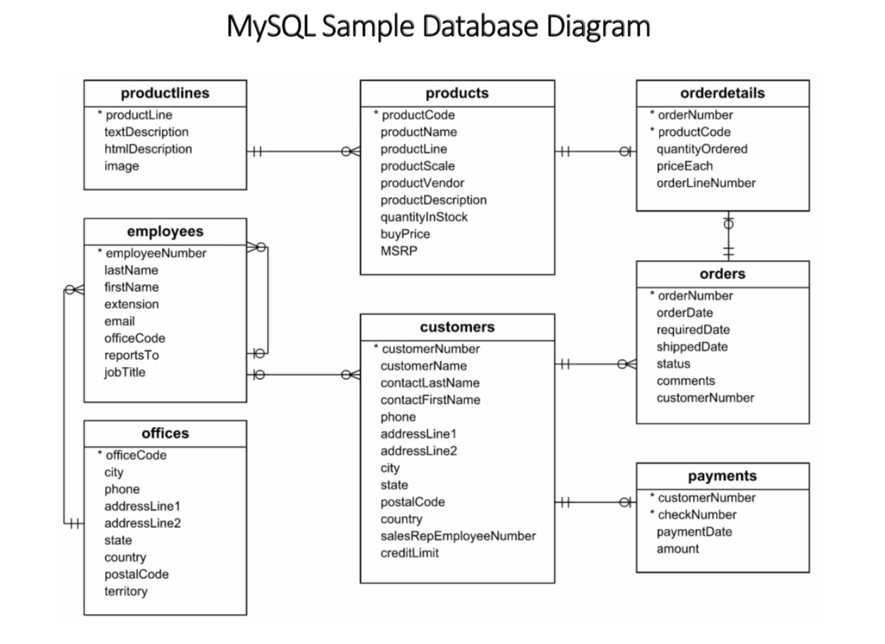

## sql-crash-course

Welcome to SQL CrashCourse, 

SQL has become the de-facto language for Data Manipulations not only in DBMS but also in other distributed databases like Apache SparkSQL, Hive, Cassandra etc..

This course will take you on a journey where you'll establish the strongest possible foundation in database development by learning 
* How to use MySQL (the most popular open source database) 
* How to Convert the complex problem statements into SQL queries.
* Write queries efficiently for production.
* Create reports.

You will learn to Set up MySQL using Docker, Work with IDEs like ATOM / Intelij.

### What you will learn ?
Create databases and queries, Use logical operators, Manipulate tables/rows/data, Understand how joins work and use them and a lot more

## Follow these instructions to Run MySQL  

> $ docker-compose up -d

#### Check if mySql Server is running
```shell script
$ docker ps
CONTAINER ID        IMAGE               COMMAND                  CREATED             STATUS              PORTS                               NAMES
64e7e9f2b055        mysql:5.7           "docker-entrypoint.s…"   30 hours ago        Up 30 hours         0.0.0.0:3306->3306/tcp, 33060/tcp   mysql
```

#### Run a command in a running mySQL container 
> $ docker exec -it ${CONTAINER_NAME} /bin/bash
* `-i` is the shortcut for --interactive option. This options is used for keep STDIN open even if not attached
* `-t` is the shortcut for --tty option, used to allocate a pseudo-TTY


```shell script
$ docker exec -it mysql /bin/bash
```

#### Login as User and Password 

```shell script
 root@64e7e9f2b055:/# whoami
 root

 # login - mysql -u ${USER_NAME} -p ${PASSWORD}
 root@64e7e9f2b055:/# mysql --user=user -p 
 Enter password: 
 Welcome to the MySQL monitor.  Commands end with ; or \g.
 Your MySQL connection id is 25
 Server version: 5.7.30 MySQL Community Server (GPL)
 
 Copyright (c) 2000, 2020, Oracle and/or its affiliates. All rights reserved.
 
 Oracle is a registered trademark of Oracle Corporation and/or its
 affiliates. Other names may be trademarks of their respective
 owners.
 
 Type 'help;' or '\h' for help. Type '\c' to clear the current input statement.
 
 mysql> 

```

You can also run commands without a interactive mode.

> $ docker exec ${CONTAINER_NAME} mysql -u ${USER_NAME} -p${PASSWORD} -e "${SQL_Statement}"
```shell script
docker exec mysql mysql -u user -pS0meVeryHardPassword -e "show databases;"
```

#### Restoring data from dump files
In this course we will be using MySQL Sample Database [classicmodels](http://www.mysqltutorial.org/mysql-sample-database.aspx)
> docker exec -i mysql sh -c 'exec mysql -u user -pS0meVeryHardPassword' < mysqlsampledatabase.sql

Other Sample Data to Work with - [Employee Sample Database](https://dev.mysql.com/doc/employee/en/)

Schema of the Database -  

